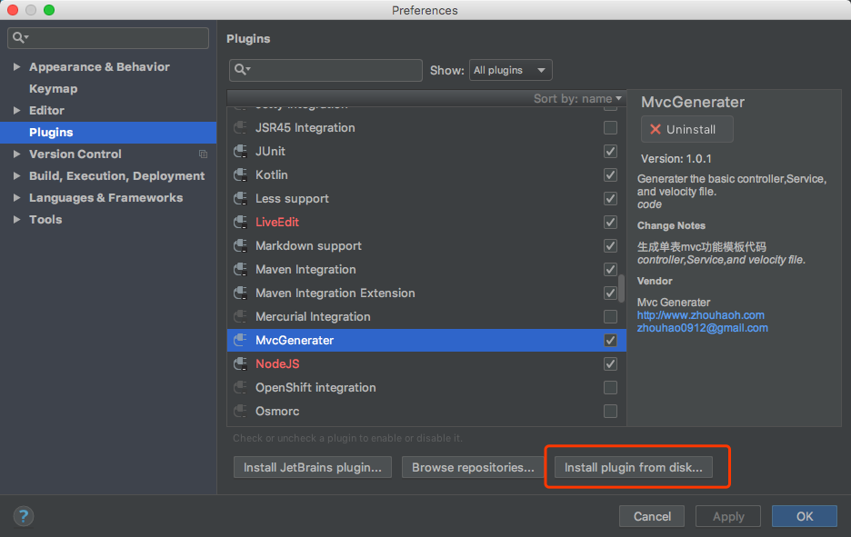
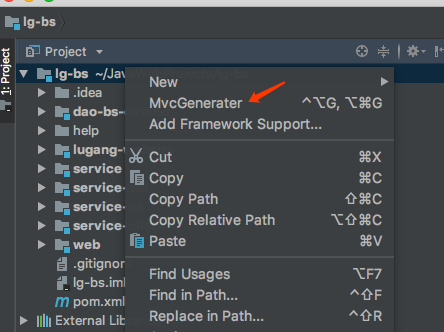
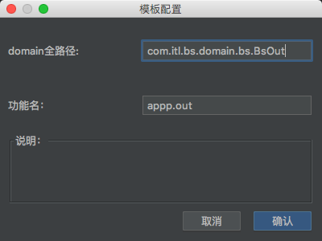
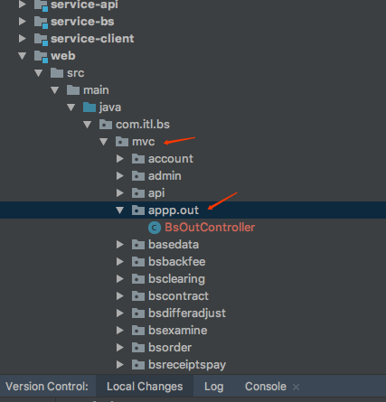
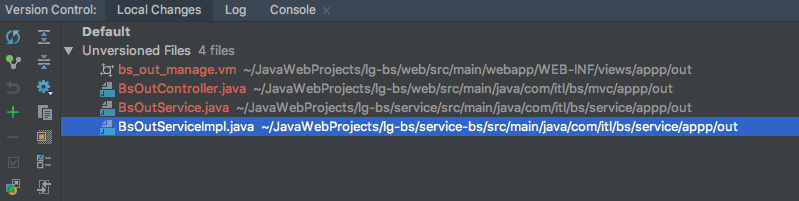

## IDEA mvc模板生成插件

### 使用说明

本插件可以用来生成简单的单表查询对应的Service，ServiceImpl，Controller，省去创建代码，重复编写简单代码的操作。使用方式如下。

#### 安装IDEA插件

打开设置选择从本地磁盘安装，选择**MvcGenerater.jar**文件：

安装完成后会提示重启IDEA。

#### 使用方式

重启完成后，在项目任意目录右键，可以看见MvcGenerater选项，点击进入模板生成配置界面。

 

#### 模板配置

主要有两个配置项：

- **domain全路径**：须填写单表页面domain的全路径包名，如上图所示。

- **功能名**：此项用来解析文件生成的目录位置。例如上面配置了**appp.out** ，就会在mvc/appp/out下生成对应的Controller。效果见下图。

  

 

#### 最终生成的文件

